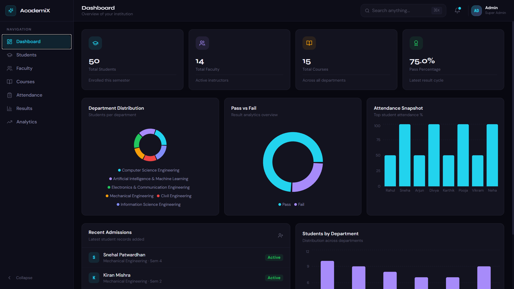
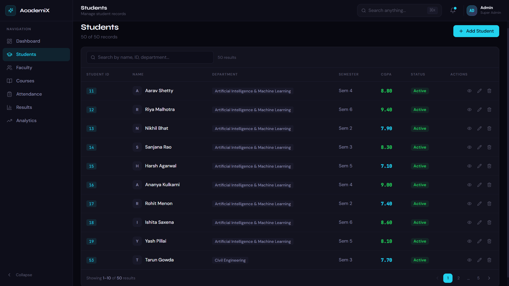
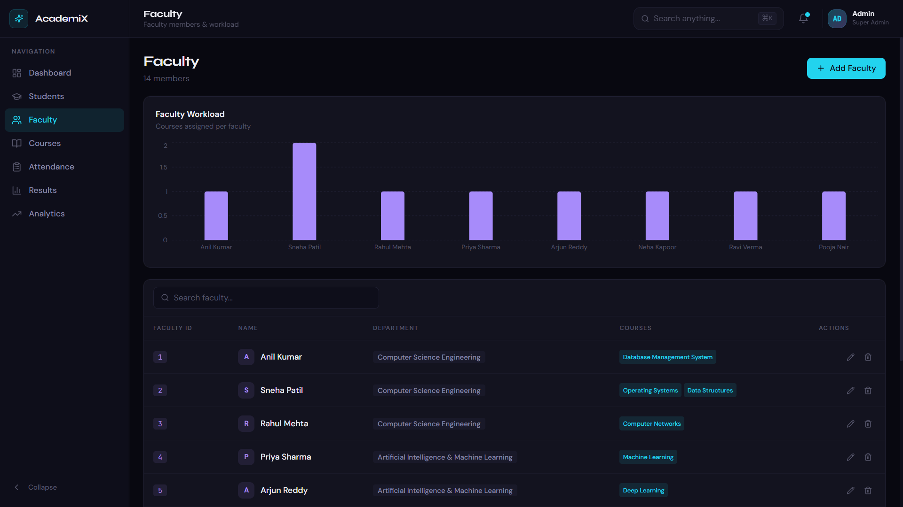
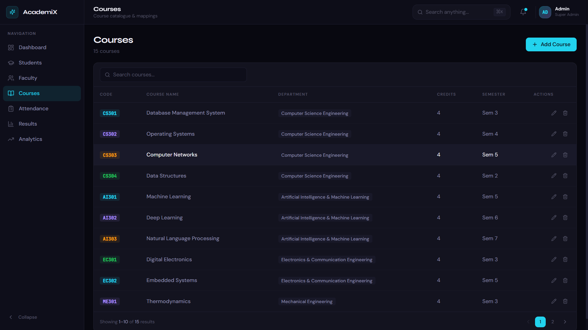
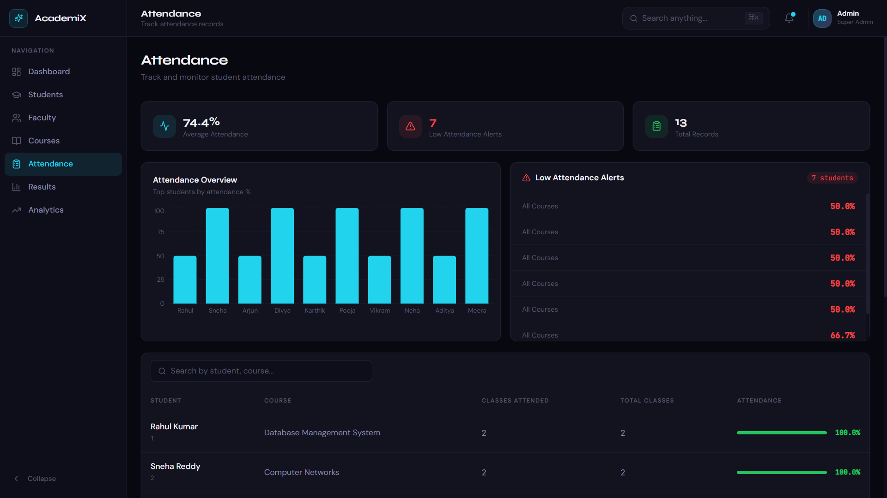
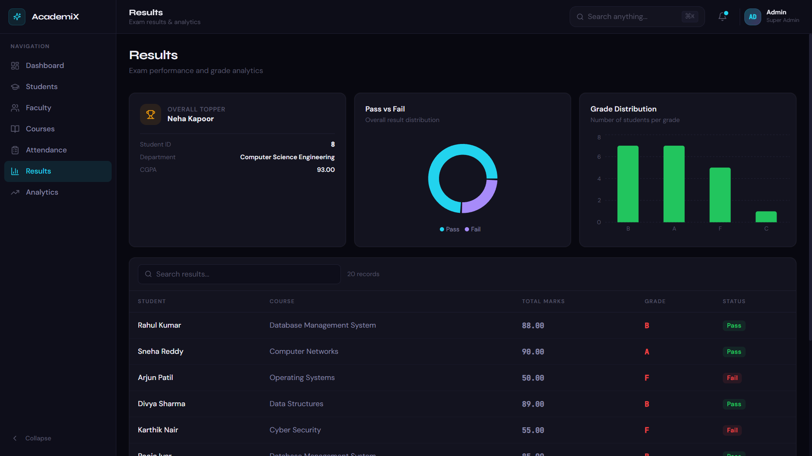
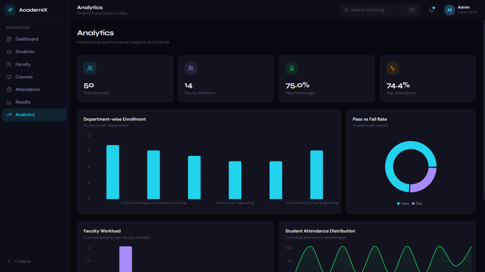
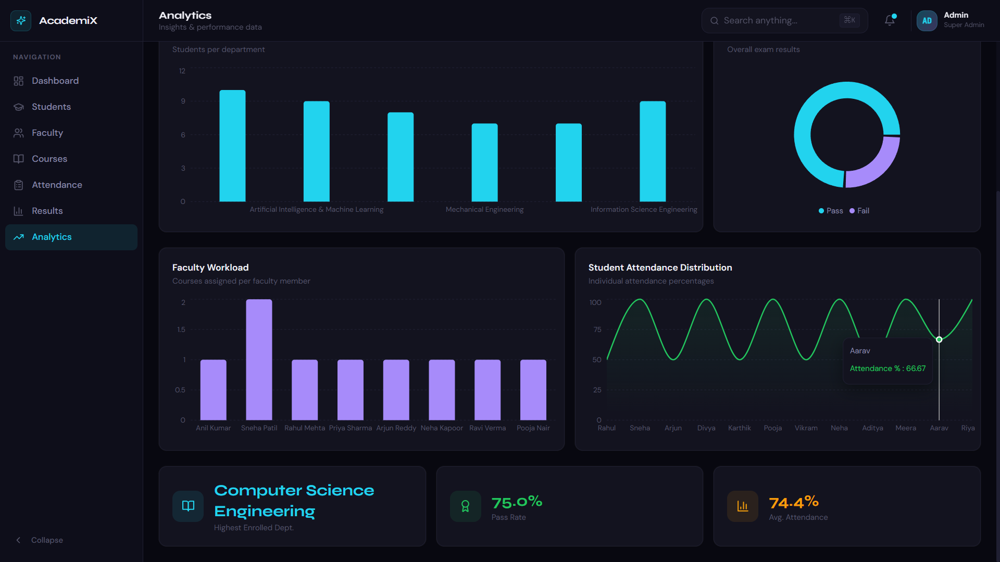

# College Management System

A modern full-stack College Management System built using React, Flask, and MySQL.  
This project helps manage students, faculty, courses, attendance, academic results, and analytics through an interactive dashboard interface.

---

# Project Overview

The system is designed to simplify college administration tasks by providing:

- Student record management
- Faculty management
- Course handling
- Attendance tracking
- Result management
- Dashboard analytics and visualizations

The application follows a full-stack architecture:

- Frontend → React + Tailwind CSS
- Backend → Flask REST API
- Database → MySQL

---

# Features

## Dashboard Analytics
- Total Students
- Total Faculty
- Total Courses
- Pass Percentage
- Department Distribution
- Attendance Snapshot
- Pass vs Fail Analytics

## Student Management
- Add Students
- Edit Student Details
- Delete Students
- View Student Profiles
- Student Search & Pagination

## Faculty Management
- Add Faculty Members
- Edit Faculty Records
- Delete Faculty Records
- Faculty Workload Analytics

## Course Management
- Add Courses
- Assign Departments
- Course Listing & Management

## Attendance Management
- Attendance Tracking
- Attendance Percentage Analytics
- Student Attendance Monitoring

## Result Management
- Student Marks
- Grade Calculation
- Pass/Fail Analytics
- Result Overview Dashboard

---

# Tech Stack

## Frontend
- React.js
- Tailwind CSS
- Recharts
- Axios
- React Router

## Backend
- Flask
- Flask-CORS
- MySQL Connector Python

## Database
- MySQL

---

# Project Structure

```txt
college_management_project/
│
├── backend/
│   ├── app.py
│   ├── db.py
│   ├── database.sql
│   ├── requirements.txt
│   └── .env
│
├── frontend/
│   ├── package.json
│   ├── vite.config.js
│   ├── src/
│   ├── public/
│   └── components/
│
├── screenshots/
│
├── README.md
└── .gitignore
 ```

## Dashboard



## Students Page


## Faculty Page


## Courses Page


## Attendance Page


## Results Page


## Analytics Page



